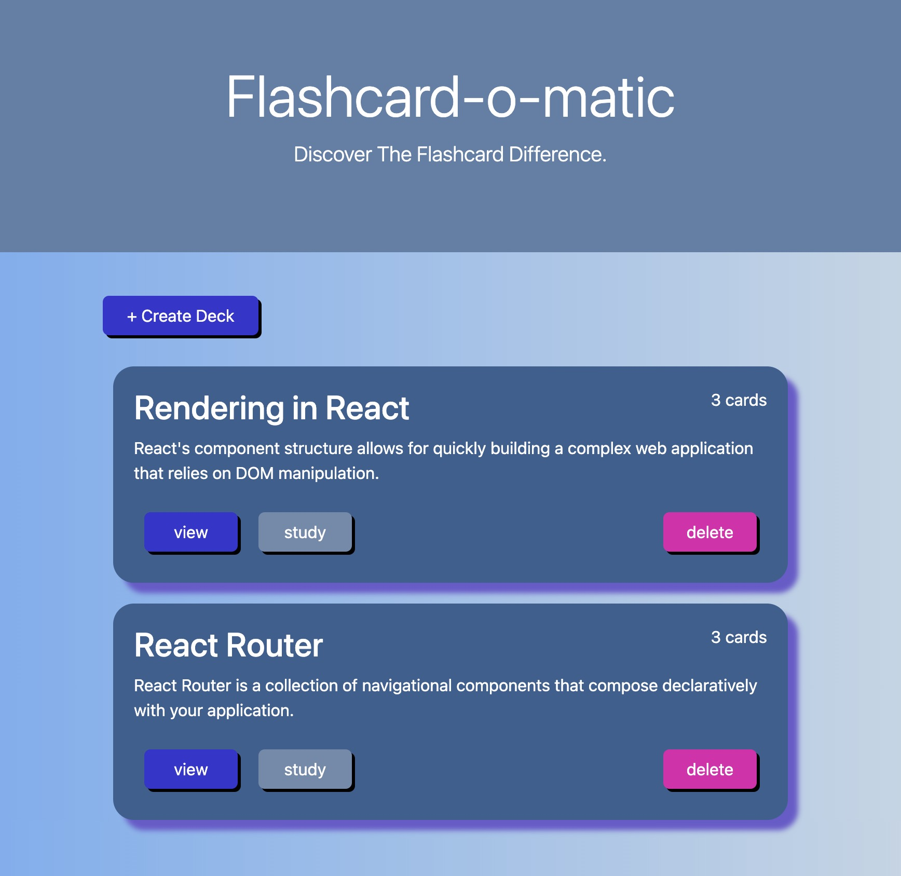
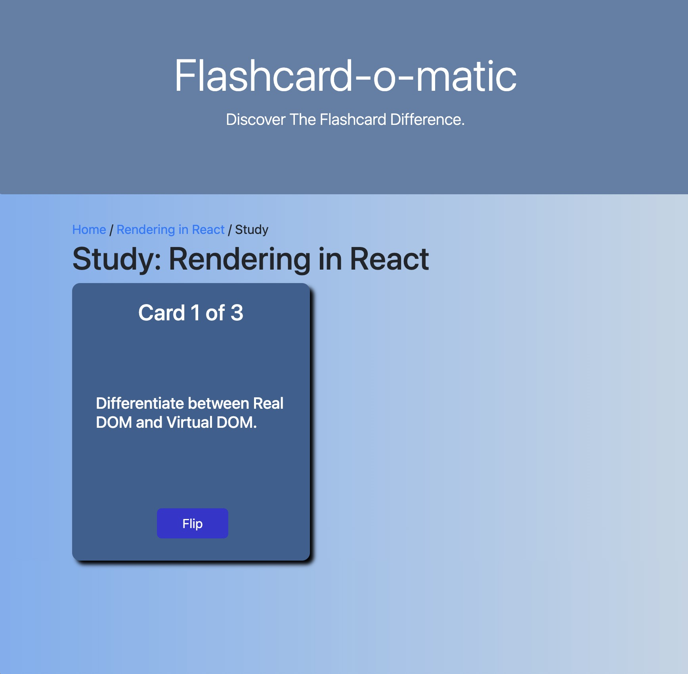

# Flashcard App

This frontend project showcases my use of React.  This project allows users to create decks of cards to aid in studying.  Decks and cards can also be edited and deleted.  

**NOTE: The deployed version is just a frontend display.  For a fully functioning app, clone the repo and run it locally.**

 

## My process

### Built with

- HTML
- CSS 
- Javascript
- React
  - react router
  - hooks: useState(), useEffect(), useParams(), and useHistory()

### What I learned

I learned alot while working through this project as it was a final project after studying react.  I learned how intricate apps can become and how it is necessary to really folow the logic and pay attention to how props are passed from one component to another.  One of the biggest learning curves was deployment.  I learned that the development process doesn't end when the app is complete, but there is often much more to do to enable that the app is built, deployed, and functioning.

### Continued development

This app was submitted as a frontend capstone project and the focus was on functionality.  I would like to go back and continue to work on the css and design elements.  I would like to make it responstive as well.  I would love for this app to be functional on the web, so I woudl also like to go back and add a full database.
